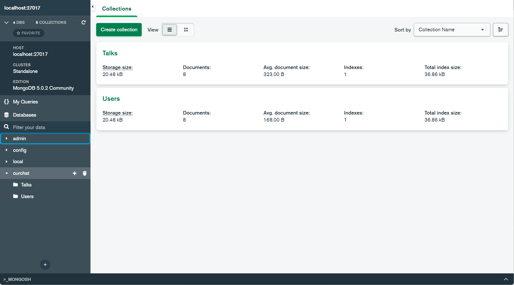

# ourchat

1 介绍
react实时聊天程序

2 软件架构  
前端：react  
后端：node  
数据库：mongodb  

3 搭建步骤  
    3.1 通过MongoDB Compass导入db文件夹中的数据，数据库格式如图  
      
    3.2 根目录中通过终端运行npm install(安装包)；  
    3.3 根目录中通过终端运行npm start(运行项目)；  
    3.4 进入/src 并通过终端运行node servers.js或nodemon servers.js，推荐使用nodemon方便调试(运行后端)；  